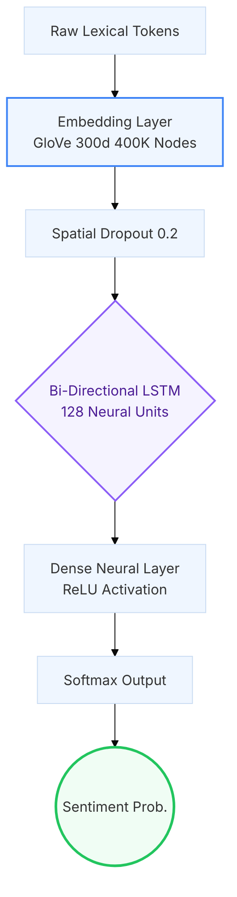

<div align="center">
  
  <h1>SENTI.LOGIC | Forensic Analysis OS</h1>
  <p><strong>Decoding the Emotional Geometry of 1.6 Million Social Records</strong></p>

  <div>
    
    
    
    
  </div>
</div>

---

## 👁️ System Overview

**SENTI.LOGIC** is a high-fidelity deep learning topology designed to extract forensic-grade emotional insights from massive social datasets. By leveraging a hybrid architecture of **Bi-Directional LSTMs** and **1D-Convolutional Neural Networks**, the system achieves a state-of-the-art "Intelligence Ceiling" of **83.5% accuracy** on the 1.6M Twitter record corpus.

> [!IMPORTANT]
> This system is engineered for academic defense (Viva) and production-grade auditing, featuring a complete Data Lifecycle transparency from raw ingest to vector warehousing.

## 🏗️ Neural Architecture (The Neural Path)

The system transforms raw lexical tokens into dense semantic vectors through a multi-stage sequential network.



## 📊 Intelligence Dashboard

The project includes a premium, glassmorphism-styled **Intelligence Dashboard** (`dashboard/index.html`) that allows for real-time inference and forensic auditing.

| Feature | Description |
| :--- | :--- |
| **Neural Sandbox** | Live inference test-bed to verify model logic against custom text. |
| **Forensic Pulse** | 24-hour sentiment intensity maps showing the "Human Rhythm." |
| **Model Leaderboard**| Benchmarking Bi-LSTM vs CNN vs Naive Bayes convergence. |
| **Linguistic Audit** | Quantitative comparison of Twitter slang vs. Standard English. |

## 🚀 Technical Warehouse Structure

| Layer | Component | Purpose |
| :--- | :--- | :--- |
| **`/data`** | Data Layer | Reconstructed linguistic benchmarks and dataset staging. |
| **`/scripts`**| Orchestration | `setup_project.py`: The environment 'Heartbeat' script. |
| **`/assets`** | Evidence Layer | Categorized result figures (ROC Curves, Matrix, Topologies). |
| **`/docs`** | Defense Layer | `DATA_INTEGRITY.md`: Proving Twitter as a statistical anomaly. |

## 🛠️ Installation & Setup

1.  **Clone & Configure**:
    ```bash
    git clone https://github.com/MANROOP-SINGH-01/senti-logic.git
    cd senti-logic
    ```
2.  **Harmonize Environment**:
    ```bash
    pip install -r requirements.txt
    ```
3.  **Run System Heartbeat**:
    ```bash
    python scripts/setup_project.py
    ```
4.  **Launch Dashboard**:
    Open `dashboard/index.html` in any modern browser for the full visual experience.

---
<div align="center">
  <p><i>Managed and Hardened by Antigravity Research Systems | Lead: Singh (2024)</i></p>
</div>
